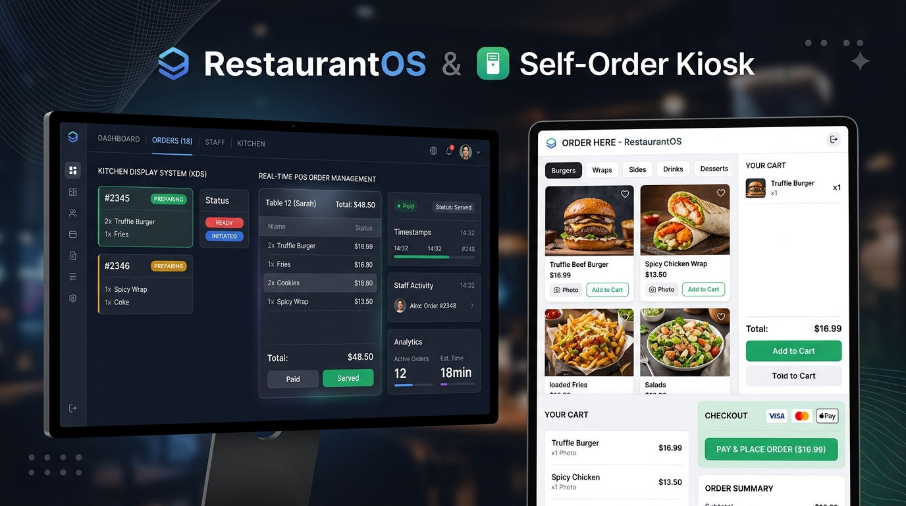
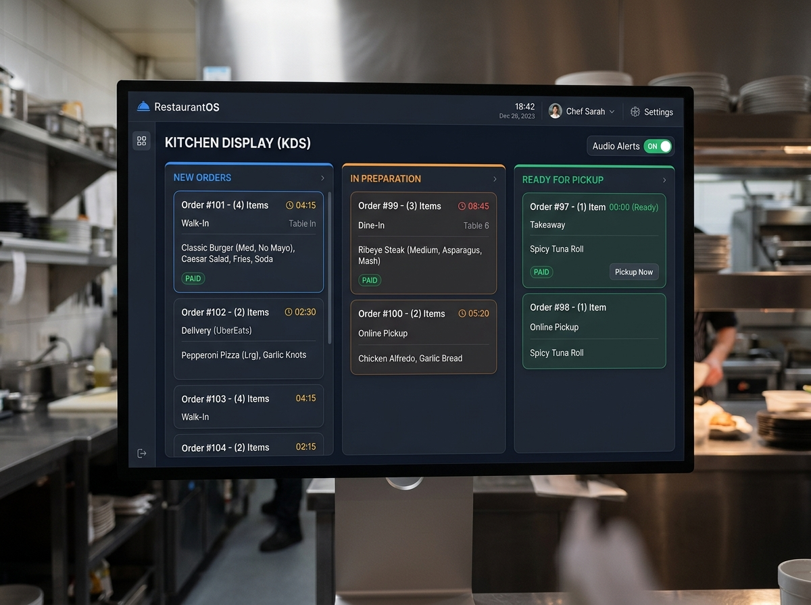
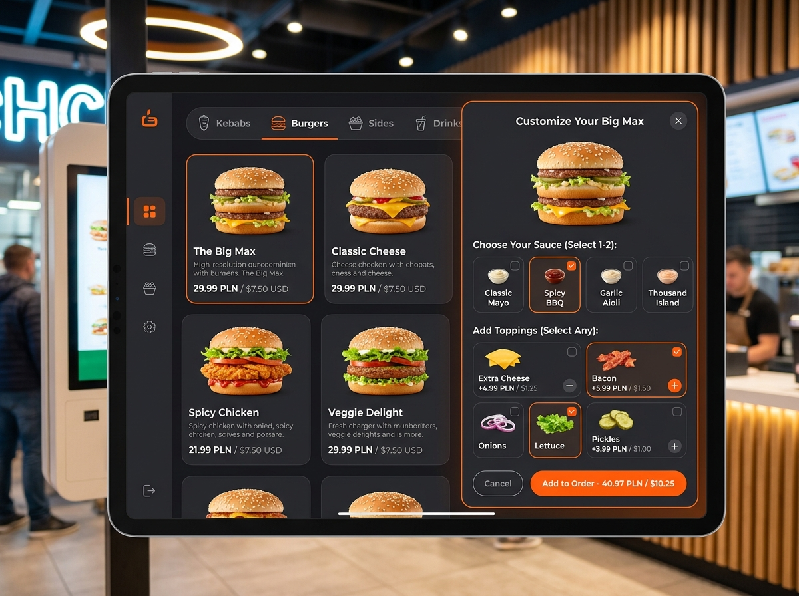

# ??? RestaurantOS & Self-Order Kiosk Suite

An enterprise-grade, real-time restaurant management operating system and self-ordering kiosk terminal suite built with modern web technologies and powered by Supabase PostgreSQL.

---

---

## ?? Overview

**RestaurantOS Suite** is a unified, end-to-end digital ordering and kitchen management platform designed for restaurants, quick-service eateries, kebab houses, and fast-food chains. It bridges customer self-service terminals with kitchen display systems (KDS), cashier point-of-sale (POS) registers, and central admin dashboards with instantaneous real-time sync.

### Key Highlights

- **? Real-Time Bidirectional Sync**: Instant order routing between Kiosks, Cashier POS, and Kitchen Display Systems (KDS) powered by PostgreSQL Realtime publications.
- **?? Interactive Self-Order Kiosk**: Engaging, touch-first customer terminal with multi-language support, smart upselling, and an advanced dynamic item customization engine.
- **?? Daily Resetting Order Sequence**: Automated daily sequence numbering (e.g., #101, #102, #142...) resetting cleanly at midnight per restaurant tenant.
- **?? Multi-Tenant Row Level Security (RLS)**: Strict database tenant isolation ensuring all data is securely scoped to individual restaurant organizations.
- **?? Multi-Channel Payment Workflows**: Supports Pay-at-Cashier, Cash, Card, BLIK, Kiosk POS, and Apple Pay flows with dedicated cashier payment confirmation states.
- **?? Business & Shift Intelligence**: Comprehensive shift opening/closing cash discrepancy management, visual analytics, PDF receipt generation, and inventory tracking.

---

## ?? Screenshots & UI Showcase

### 1. Kitchen Display (KDS) & Real-Time POS Dashboard
Kanban-style live order pipeline with auditory alerts, timer thresholds, order item drill-downs, and instant status transitions (PAYMENT_PENDING ? PREPARING ? READY ? COMPLETED).

### 2. Touch Self-Order Kiosk & Customizer Engine
High-conversion food catalog with category filters, dynamic modifier groups (single/multiple select toppings, custom sauces, removals, extra patties), and live cart calculation.

---

## ??? Architecture & Modules

The repository is organized into a modular monorepo structure:

`
RestaurantOS-SelfOrderKiosk/
+-- OS/                             # RestaurantOS Admin, Cashier POS & KDS Web App
¦   +-- src/
¦   ¦   +-- components/             # Reusable UI components (orders, layout, auth)
¦   ¦   +-- context/                # Auth & Tenant Context providers
¦   ¦   +-- hooks/                  # Live orders & realtime WebSocket subscriptions
¦   ¦   +-- pages/                  # Admin, Live Orders, Menu, Shifts, Inventory, Staff
¦   ¦   +-- utils/                  # PDF receipt generators, Excel exports, seeders
¦   ¦   +-- lib/supabaseClient.js   # Supabase client singleton
¦   +-- package.json
¦   +-- vite.config.js
¦
+-- Self_Order_Kiosk/               # Customer-Facing Touch Kiosk Application
¦   +-- src/
¦   ¦   +-- components/             # Product cards, customizer modal, drawer, checkout
¦   ¦   +-- context/                # Kiosk state (cart, language, theme, restaurant)
¦   ¦   +-- data/                   # Translations (TR, EN, PL, UK), themes & fallback data
¦   ¦   +-- hooks/                  # Touch gestures & long-press event handlers
¦   ¦   +-- lib/supabaseClient.js   # Kiosk Supabase client
¦   +-- package.json
¦   +-- vite.config.js
¦
+-- supabase/                       # Database Migrations & Edge Functions
¦   +-- functions/
¦   ¦   +-- create-staff-account/   # Secure Deno Edge Function for creating staff/kiosks
¦   +-- migrations/                 # Version-controlled SQL migration scripts (01 to 13)
¦
+-- docs/                           # Documentation & visual assets
¦   +-- screenshots/                # Showcase images & architecture diagrams
¦
+-- supabase_schema.sql             # Unified master SQL schema (Single-file setup)
+-- supabase_reset.sql              # Database wipe & cleanup script
+-- README.md
`

---

## ?? Key Features

### ??? 1. RestaurantOS (Management & POS)
- **Live Kitchen Display (KDS)**: Kanban order boards categorized by status with visual timers and audio chime notifications on new incoming orders.
- **Cashier POS & Payment Confirmation**: One-click settlement of Pay-at-Cashier kiosk orders with cash calculation and receipt generation.
- **Menu & Modifier Builder**: Full CRUD operations for menu categories, items, pricing, allergens, preparation times, and JSONB product customization options.
- **Shift & Till Management**: Shift opening with initial cash float, real-time sales tracking (Cash vs. Card), and shift closing cash discrepancy calculations.
- **Staff & Role-Based Access (RBAC)**: Supports roles: dmin, manager, cashier, kitchen, organizer, kiosk with quick 4-digit PIN verification.
- **Device Pairing System**: 6-digit expiring pairing code system for connecting new kiosk tablets and kitchen displays.
- **Reporting & Export**: Export transaction histories, revenue reports, and PDF order tickets via jspdf and jspdf-autotable.

### ?? 2. Self-Order Kiosk Terminal
- **Touch-First UX**: Responsive, ultra-fast interface optimized for landscape and portrait tablet touchscreens.
- **Dynamic Product Customizer**:
  - Single-choice selections (e.g., Doner meat type, bread vs. wrap).
  - Multiple-choice selections with minimum/maximum constraints (e.g., Pick up to 2 sauces).
  - Add-on toppings with incremental pricing (e.g., Extra Cheese +3.50 PLN, Bacon +5.00 PLN).
  - Ingredient removal (e.g., No Onion, No Tomato).
- **Multilingual Support**: Instant locale switching across English (en), Turkish (	r), Polish (pl), and Ukrainian (uk).
- **Upsell & Cross-sell Engine**: Recommends drinks, fries, or desserts before final checkout based on cart composition.
- **Kiosk Administration**: Hidden long-press administrative drawer with PIN lock (1234) for changing kiosk themes, restaurant logos, fullscreen mode, or signing out.

---

## ??? Getting Started

### Prerequisites
- [Node.js](https://nodejs.org/) (v18.0.0 or higher)
- [npm](https://www.npmjs.com/) or [pnpm](https://pnpm.io/)
- A free [Supabase](https://supabase.com/) project account

---

### Step 1: Database Setup (Supabase)

1. Create a new project in the [Supabase Dashboard](https://app.supabase.com).
2. Go to the **SQL Editor** in your Supabase dashboard.
3. Open [supabase_schema.sql](supabase_schema.sql) from this repository, paste the contents into the SQL Editor, and click **Run**.
4. *(Optional)* If you are developing locally with Supabase CLI, run:
   `ash
   npx supabase db push
   `

---

### Step 2: Environment Configuration

Copy the example environment files in both project folders and provide your Supabase credentials:

#### For OS/:
`ash
cd OS
cp .env.example .env
`
Edit OS/.env:
`env
VITE_SUPABASE_URL=https://your-project-id.supabase.co
VITE_SUPABASE_ANON_KEY=your-supabase-anon-key
`

#### For Self_Order_Kiosk/:
`ash
cd ../Self_Order_Kiosk
cp .env.example .env
`
Edit Self_Order_Kiosk/.env:
`env
VITE_SUPABASE_URL=https://your-project-id.supabase.co
VITE_SUPABASE_ANON_KEY=your-supabase-anon-key
`

---

### Step 3: Run the Applications

#### Run RestaurantOS (POS & Admin):
`ash
cd OS
npm install
npm run dev
`
Accessible at http://localhost:5173/

#### Run Self-Order Kiosk:
`ash
cd Self_Order_Kiosk
npm install
npm run dev
`
Accessible at http://localhost:5174/

---

## ?? Security & Data Isolation

- **Row Level Security (RLS)**: Enforced across all relational tables (
estaurants, profiles, devices, categories, menu_items, orders, shifts, customers).
- **Zero Secrets in Code**: All API keys and environment variables are strictly managed via .env and excluded from source control.
- **Encrypted Password Storage**: Staff passwords and credentials are securely hashed using pgcrypto (crypt).
- **Edge Function Auth Gate**: Staff creation and device provisioning are handled through authenticated Edge Functions with caller role validation.

---

## ?? Tech Stack

| Layer | Technology |
| :--- | :--- |
| **Frontend Framework** | [React 18](https://react.dev/) |
| **Build Tooling** | [Vite 6](https://vitejs.dev/) |
| **Styling** | [Tailwind CSS 3](https://tailwindcss.com/) |
| **Icons** | [Lucide React](https://lucide.dev/) |
| **Document Export** | [jsPDF](https://github.com/parallax/jsPDF) & [jsPDF-AutoTable](https://github.com/simonbengtsson/jsPDF-AutoTable) |
| **Database & Auth** | [Supabase PostgreSQL 15+](https://supabase.com/) |
| **Realtime Engine** | Supabase Realtime (WebSocket CDC) |
| **Serverless Functions** | Supabase Edge Functions ([Deno](https://deno.land/)) |

---

## ?? License

This project is licensed under the MIT License - see the [LICENSE](LICENSE) file for details.

---

## ????? Author & Contributions

Developed and maintained by **[Görsel Güler](https://github.com/gorselguler)**.  
Contributions, issues, and feature requests are welcome! Feel free to check the [issues page](https://github.com/gorselguler/RestaurantOS-SelfOrderKiosk/issues).
